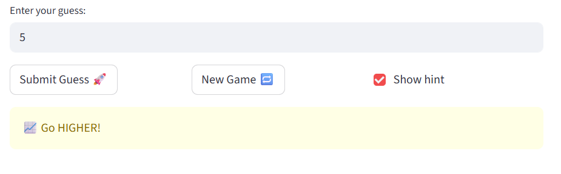
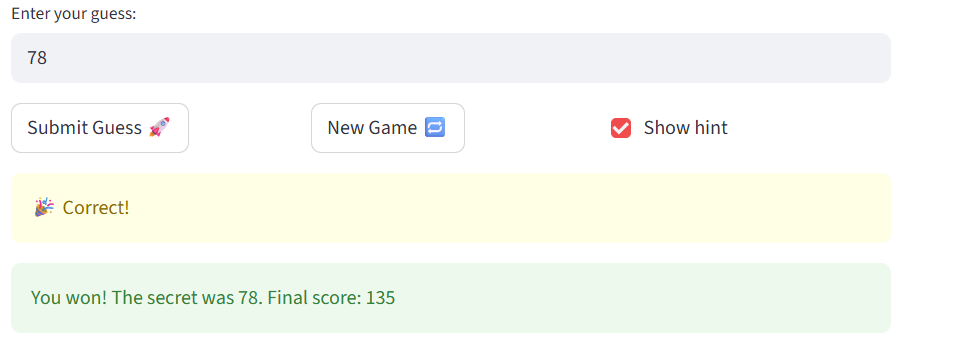
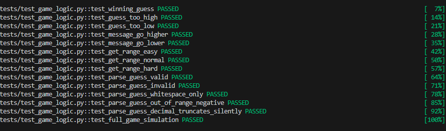

# 🎮 Game Glitch Investigator: The Impossible Guesser

## 🚨 The Situation

You asked an AI to build a simple "Number Guessing Game" using Streamlit.
It wrote the code, ran away, and now the game is unplayable. 

- You can't win.
- The hints lie to you.
- The secret number seems to have commitment issues.

## 🛠️ Setup

1. Install dependencies: `pip install -r requirements.txt`
2. Run the broken app: `python -m streamlit run app.py`

## 🕵️‍♂️ Your Mission

1. **Play the game.** Open the "Developer Debug Info" tab in the app to see the secret number. Try to win.
2. **Find the State Bug.** Why does the secret number change every time you click "Submit"? Ask ChatGPT: *"How do I keep a variable from resetting in Streamlit when I click a button?"*
3. **Fix the Logic.** The hints ("Higher/Lower") are wrong. Fix them.
4. **Refactor & Test.** - Move the logic into `logic_utils.py`.
   - Run `pytest` in your terminal.
   - Keep fixing until all tests pass!

## 📝 Document Your Experience

- [ ] Describe the game's purpose.
- Player guesses A number from 1-100
- [ ] Detail which bugs you found.
- 1. The history would not be cleared even user start a new game, and the game cannot submit guess when start a new game whether the user won last time
- 2. The hint is opponent. If user input a number higher than the secret number, the hint would say go higher; if user input a number lower than the secret number, the hint would say go lower.
- 3. The range should be 1 to 100, however, numbers out of this range are also be accepted.
- [ ] Explain what fixes you applied.
- I fixed issue 1 by rewrite initialization of new game. Fixed issue 2 by change the check_guess function logic.

## 📸 Demo

- [ ] [Insert a screenshot of your fixed, winning game here]

## 🚀 Stretch Features

- [ ] [If you choose to complete Challenge 4, insert a screenshot of your Enhanced Game UI here]

- The following is challenge 1
